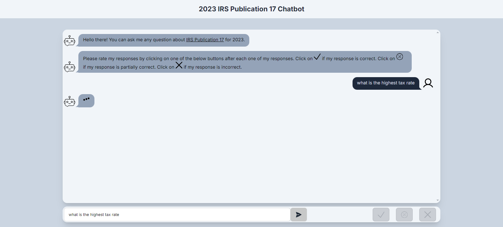

# Tax RAG App

### A chat application that uses RAG (Retrieval Augmented Generation) to query the 2023 IRS [Publication 17](https://www.irs.gov/pub/irs-pdf/p17.pdf) to answer tax questions a user may have.

<a href="https://taxragapp.vercel.app/" target="_blank">Live Site</a>

Users are able to rate the bot's responses.

The site is also responsive to devices of different sizes.

### Mobile

### Tablet

## Backend Services

Below are links to the READMEs of the backend services I created to run the app

<a href="https://github.com/randr000/tax_llm" target="_blank">Chat Service</a> 
<a href="https://github.com/randr000/tax_llm_node_app" target="_blank">Database and Mailer Service</a> 
<a href="https://github.com/randr000/tax_llm_node_api_gateway" target="_blank">API Gateway</a>