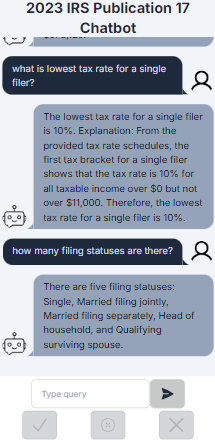

# Tax RAG App

### A chat application that uses RAG (Retrieval Augmented Generation) to query the 2023 IRS [Publication 17](https://www.irs.gov/pub/irs-pdf/p17.pdf) to answer tax questions a user may have.

